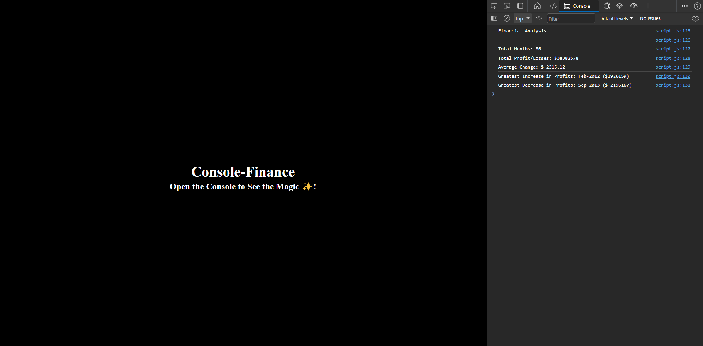

# edxbootcamp_Module4challege4_Console-Finance

## Description

This module challege is about analyzing the finanical records of a company.

## Task needed to achieve this module

* The total number of months included in the dataset.

* The net total amount of Profit/Losses over the entire period.

* The average of the changes in Profit/Losses over the entire period.

    * You will need to track what the total change in profits is from month to month and then find the average.

    * (Total/(Number of months - 1))

* The greatest increase in profits (date and amount) over the entire period.

* The greatest decrease in losses (date and amount) over the entire period.


## Installation

N/A

## Usage 

N/A

## Output of the website

```md

```


## Link to deployed application


## License

none


